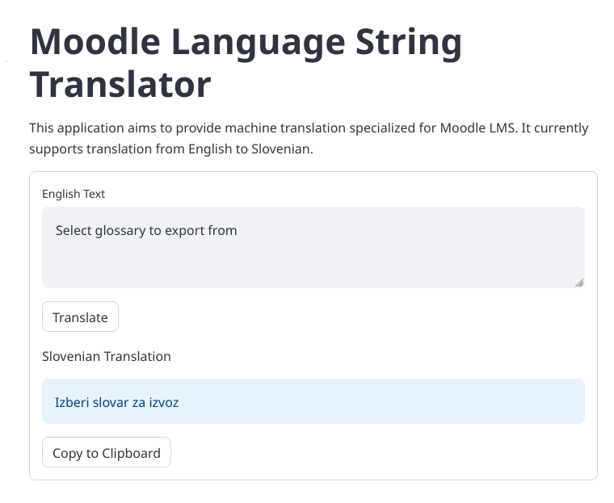

# Moodle Language String Translator

This application aims to provide machine translation specialized for Moodle LMS. It currently supports translation from English to Slovenian.

## CTranslate-NMT-Web-Interface

Machine Translation (MT) Web Interface for OpenNMT and FairSeq models using *CTranslate* and *Streamlit*.

## Install requirements

It is recommended you first create a virtual environment, and then run:

```
pip3 install -r requirements.txt
```

## Run Moodle Language String Translator

With [translate.py](translate.py), you can run "Moodle Language String Translator" using the command:
```
streamlit run translate.py
```



Note: This application assumes SentencePiece was used to prepare the data. If you did not use SentencePiece, remove the relevant lines.

## Tutorial

Check the detailed instructions at in this [blog tutorial](https://blog.machinetranslation.io/nmt-web-interface/) by ymoslem.

## Acknowledgements

The development of this application and the neural machine translation models
used within it were based on tutorials provided by ymoslem.
Thanks to ymoslem's sharing of these excellent tutorials,
I was able to create this application.
I express my utmost gratitude and respect to ymoslem.

OpenNMT-Tutorial
https://github.com/ymoslem/OpenNMT-Tutorial

CTranslate-NMT-Web-Interface
https://github.com/ymoslem/CTranslate-NMT-Web-Interface/tree/main
